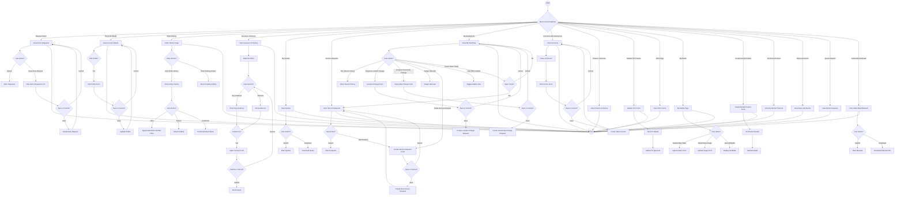

```mermaid

graph TD
    A((Start)) --> B{My Account Dropdown}
    B -->|Request Demo| C[View Demo Requests]
    B -->|Personal Details| D[View Account Details]
    B -->|Order History| E[Order History Page]
    B -->|Insurance Schemes| F[View Insurance Schemes]
    B -->|My Quotes| G[View Quotes]
    B -->|Service Requests| H[View Service Requests]
    B -->|My Equipments| I[View My Machines]
    B -->|Concerns and Grievances| J[View Concerns]
    B -->|Finance Schemes| K[View Finance Schemes]
    B -->|Update KYC Status| L[Update KYC Form]
    B -->|OCF Page| M[View OCF Forms]
    B -->|My Media| N[My Media Page]
    B -->|Create Rental Product| O[Create Rental Product Form]
    B -->|My Rental Product| P[View My Rental Products]
    B -->|News and Event| Q[View News and Events]
    B -->|Quote Request| R[View Quote Requests]
    B -->|Subscribed Manuals| S[View Subscribed Manuals]

    C --> C1{User Action?}
    C1 -->|Search| C2[Filter Requests]
    C1 -->|Raise New Request| C3[New Demo Request Form]
    C3 --> C4{Save or Cancel?}
    C4 -->|Save| C5[Create New Request]
    C4 -->|Cancel| C
    C5 --> C

    D --> D1{Edit Profile?}
    D1 -->|Yes| D2[Edit Profile Form]
    D2 --> D3{Save or Cancel?}
    D3 -->|Save| D4[Update Profile]
    D3 -->|Cancel| D
    D4 --> D

    E --> E1{View Section?}
    E1 -->|View Order History| E2[Show Order History]
    E2 --> E3{User Action?}
    E3 -->|Filter| E4[Apply Date/Order Number Filter]
    E3 -->|Search| E5[Search Orders]
    E3 -->|Download| E6[Download Excel Sheet]
    E1 -->|View Pending Orders| E7[Show Pending Orders]

    F --> F1[Select Scheme]
    F1 --> F2{View Section?}
    F2 -->|Key Features| F3[Show Key Features]
    F2 -->|Add-ons| F4[Show Add-ons]
    F3 --> F5{Contact Us?}
    F4 --> F5
    F5 -->|Yes| F6[Open Contact Form]
    F6 --> F7{Submit or Cancel?}
    F7 -->|Submit| F8[Send Inquiry]
    F7 -->|Cancel| F2

    G --> G1{User Action?}
    G1 -->|Search| G2[Filter Quotes]
    G1 -->|Download| G3[Download Quote]

    H --> H1{User Action?}
    H1 -->|Search| H2[Filter Requests]
    H1 -->|New Request| H3[Create Service Request Form]
    H3 --> H4{Save or Cancel?}
    H4 -->|Save| H5[Create New Service Request]
    H4 -->|Cancel| H
    H5 --> H

    I --> I1{User Action?}
    I1 -->|See Recent History| I2[Show Recent History]
    I1 -->|Request Location Change| I3[Location Change Form]
    I3 --> I3a{Save or Cancel?}
    I3a -->|Save| I3b[Create Location Change Request]
    I3a -->|Cancel| I
    I1 -->|Request Ownership Change| I4[Ownership Change Form]
    I4 --> I4a{Save or Cancel?}
    I4a -->|Save| I4b[Create Ownership Change Request]
    I4a -->|Cancel| I
    I1 -->|Assign Operator| I5[Assign Operator]
    I1 -->|Raise Service Request| H3
    I1 -->|View More Details| I6[Toggle Details View]
    I1 -->|Check Open Ticket| I7{Open Ticket?}
    I7 -->|Yes| H
    I7 -->|No| I

    J --> J1[Raise a Concern]
    J1 --> J2[Fill Concern Form]
    J2 --> J3{Save or Cancel?}
    J3 -->|Save| J4[Create New Concern]
    J3 -->|Cancel| J
    J4 --> J

    L --> L1[Fill KYC Details]
    L1 --> L2[Submit for Approval]

    N --> N1{User Action?}
    N1 -->|Submit New Video| N2[Upload Video Form]
    N1 -->|Submit New Image| N3[Upload Image Form]
    N1 -->|View All Media| N4[Display All Media]

    O --> O1[Fill Product Details]
    O1 --> O2[Submit Details]

    S --> S1{User Action?}
    S1 -->|Search| S2[Filter Manuals]
    S1 -->|Download| S3[Download Manual PDF]

    C --> T((End))
    D --> T
    E --> T
    F --> T
    G --> T
    H --> T
    I --> T
    J --> T
    K --> T
    L --> T
    M --> T
    N --> T
    O --> T
    P --> T
    Q --> T
    R --> T
    S --> T

```